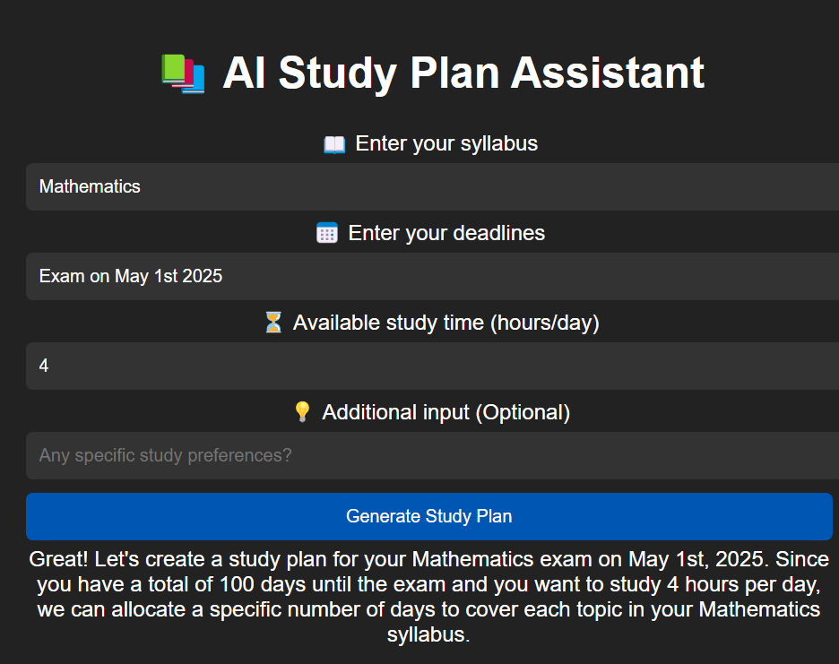
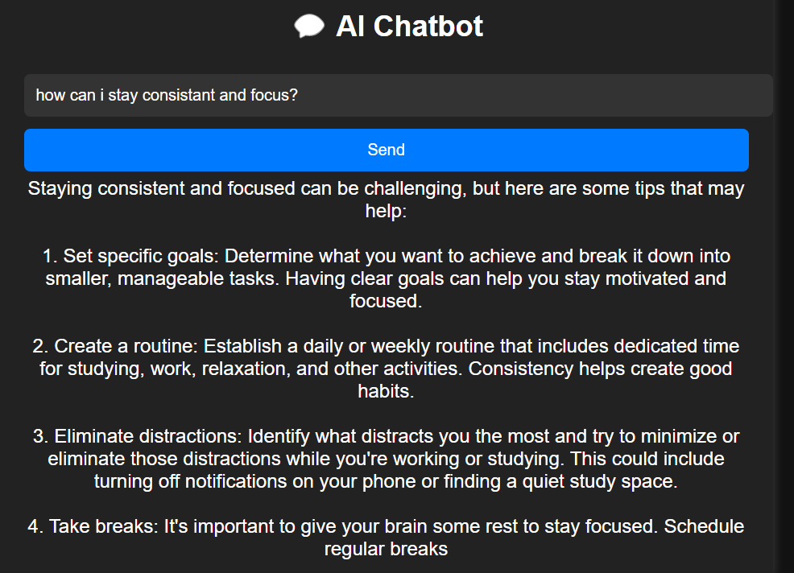
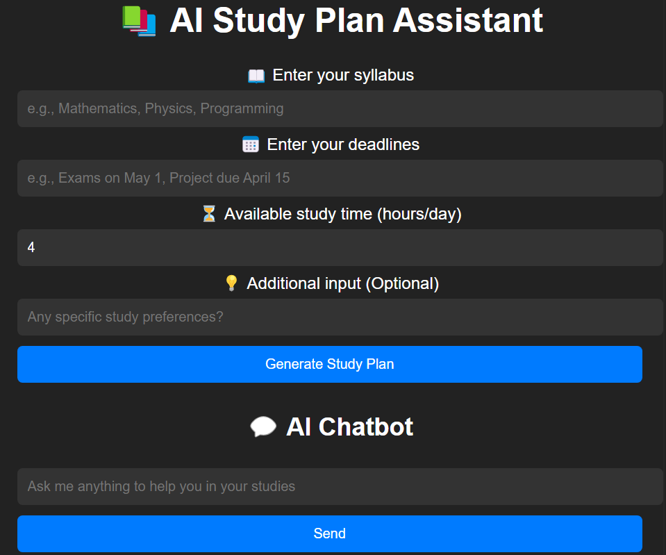

# AI-STUDY-PLANNER-ASSISTANT

# Overview

AI Study Plan Generator is a web-based tool that creates personalized study plans
 based on your syllabus, deadlines, and available study time. 
 It also includes a chatbot to assist students with study tips.
----------------------------------------------
# Technologies Used:

Flask (Backend)
OpenAI GPT-3.5 (For AI-based study planning)
HTML, CSS (Frontend)
-----------------------------------------------
# Features
1.AI-generated study plans based on syllabus & deadlines
2.Customizable daily study time3.Interactive AI Chatbot for study tips 3.
User-friendly web interface.
-----------------------------------------------
# Installation & Setup

1.Clone the Repository
git clone https://github.com/dhivya210/AI-STUDY-PLANNER-ASSISTANT.git
cd ai-study-planner

2.Install Dependencies
pip install -r requirements.txt

3.Add Your OpenAI API Key
Edit app.py and replace "API_KEY" with your actual OpenAI API key.

4.Run the Application
python app.py

5.Open in Browser
Go to http://127.0.0.1:7860
-----------------------------------------------
# Usage Guide and Features
--Generate a Study Plan
1.Enter your subjects (e.g., Mathematics, Physics, Programming).
2.Add deadlines (e.g., Exams on May 1, Project due April 15).
3.Set daily study hours (e.g., 4 hours/day).
4.Click "Generate Study Plan" → AI creates a customized plan!

-- Use the AI Chatbot
Ask study tips, time management strategies, or subject-related questions.

Example: "How can I improve my coding skills?"
-----------------------------------------------
# Testing & Edge Cases
Empty fields should return an error message. PASSED!
Study plan adjusts if study hours are too low or too high. PASSED!
Chatbot answers study-related questions correctly. PASSED!
-----------------------------------------------
# Future Improvements
1.Better AI-based time optimization for study slots
2.Multi-language support
3.Google Calendar Integration to schedule study plans
4.Progress tracking & study reminders
-----------------------------------------------
# SCREENSHOTS

-------------------------------------------------

